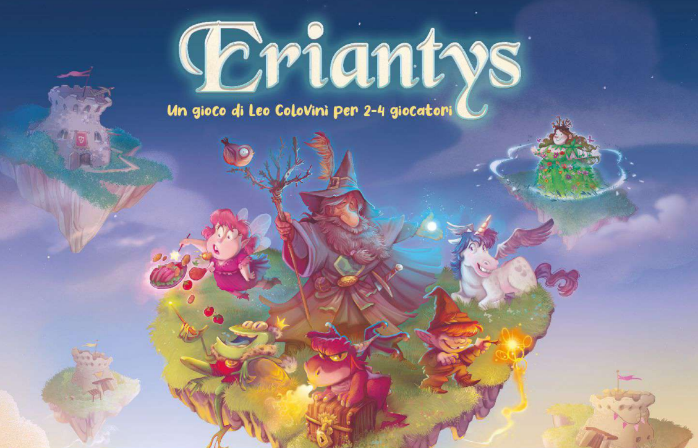

<div id="top"></div>

<!-- PROJECT SHIELDS -->
[![MIT License][license-shield]][license-url]


<!-- PROJECT LOGO -->
<br />
<div align="center">
  <a href="">
    
  </a>

<h3 align="center">ERIANTYS</h3>

  <p align="center">
    a game made by Leo Colovini
    <br />
    <a href="https://github.com/andreaalbergo/ingsw2022-AM48"><strong>Explore the docs »</strong></a>
    <br />
    <br />
  </p>
</div>


<!-- TABLE OF CONTENTS -->
<details>
  <summary>Table of Contents</summary>
  <ol>
    <li>
      <a href="#about-the-project">About The Project</a>
      <ul>
        <li><a href="#built-with">Built With</a></li>
      </ul>
    </li>
    <li>
      <a href="#getting-started">Getting Started</a>
      <ul>
        <li><a href="#prerequisites">Prerequisites</a></li>
        <li><a href="#installation">Installation</a></li>
      </ul>
    </li>
    <li><a href="#features">FEATURES</a></li>
    <li>
       <a href="#prerequisites">Prerequisites</a>
      <ul>
       <li><a href="#group">Group</a></li>
      </ul>
    </li>
    <li>
      <a href="#license">Copyright and license</a>
    </li>
  </ol>
</details>


<!-- ABOUT THE PROJECT -->
## About The Project

### PROFESSOR - ALESSANDRO MARGARA
<p align="right">(<a href="#top">back to top</a>)</p>


### Built With

* [IntelliJ IDEA] (https://www.jetbrains.com/idea/)

<p align="right">(<a href="#top">back to top</a>)</p>


<!-- GETTING STARTED -->
## Getting Started

This is an example of how you may give instructions on setting up your project locally.
To get a local copy up and running follow these simple example steps.

### Prerequisites

This is an example of how to list things you need to use the software and how to install them.
* npm
  ```sh
  npm install npm@latest -g
  ```

### Installation

1. Get a free API Key at [https://example.com](https://example.com)
2. Clone the repo
   ```sh
   git clone https://github.com/github_username/repo_name.git
   ```
3. Install NPM packages
   ```sh
   npm install
   ```
4. Enter your API in `config.js`
   ```js
   const API_KEY = 'ENTER YOUR API';
   ```

<p align="right">(<a href="#top">back to top</a>)</p>


## FEATURES
### DEVELOPED FEATURES
- Simplified rules
- CLI
- Socket
- GUI's assets (gui is incomplete unfortunately)

<p align="right">(<a href="#top">back to top</a>)</p>

<!-- CONTACTS -->
## Group
- [__Andrea Albergo__](https://github.com/andreaalbergo) - andrea.albergo@mail.polimi.it 
- [__David Loredan Barb__](https://github.com/DavidLoredan-Barb) - davidloredan.barb@mail.polimi.it 
- [__Edoardo Bozzi__](https://github.com/EdoardoBoz) - edoardo.bozzini@mail.polimi.it


Project Link: [https://github.com/andreaalbergo/ingsw2022-AM48](https://github.com/andreaalbergo/ingsw2022-AM48)

<p align="right">(<a href="#top">back to top</a>)</p>


## Copyright and license

Eriantys Game is copyright 2022.

Licensed under the **[MIT License](https://github.com/andreaalbergo/ingsw2022-AM48/LICENSE)** ;
you may not use this software except in compliance with the License.


<!-- MARKDOWN LINKS & IMAGES -->
[license]: https://github.com/andreaalbergo/ingsw2022-AM48/LICENSE
[license-image]: https://img.shields.io/badge/License-MIT-blue.svg

[forks-shield]: https://img.shields.io/github/forks/github_username/repo_name.svg?style=for-the-badge
[forks-url]: https://github.com/github_username/repo_name/network/members
[stars-shield]: https://img.shields.io/github/stars/github_username/repo_name.svg?style=for-the-badge
[stars-url]: https://github.com/github_username/repo_name/stargazers
[issues-shield]: https://img.shields.io/github/issues/github_username/repo_name.svg?style=for-the-badge
[issues-url]: https://github.com/github_username/repo_name/issues
[license-shield]: https://img.shields.io/github/license/github_username/repo_name.svg?style=for-the-badge
[license-url]: https://github.com/github_username/repo_name/blob/master/LICENSE.txt
[linkedin-shield]: https://img.shields.io/badge/-LinkedIn-black.svg?style=for-the-badge&logo=linkedin&colorB=555
[linkedin-url]: https://linkedin.com/in/linkedin_username
[product-screenshot]: images/screenshot.png
